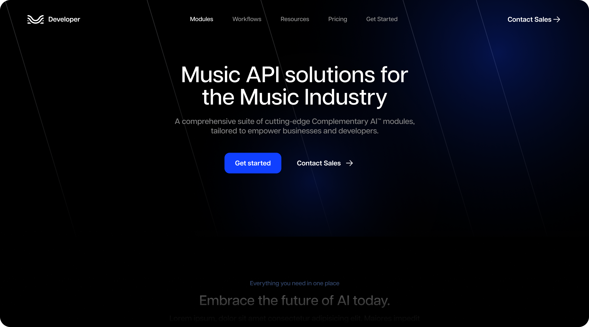

# Moises - Front-end Growth Test



## Requirements

- The project is bootstraped using [Next.js](https://nextjs.org/).
- Implement this design using React and Typescript.

## Rules

- You’ll notice the CMS payload contains the home page data in English and Portuguese, meaning the Front-end should be multi-lang, it should also be prepared to easily scale to new languages or new pages if necessary.
- All the images needed are available in the payload. (icons are in figma)
- The page should be responsive, follow SEO best practices and be carefully crafted.
- The intention of this test is to evaluate your ability to transpose a layout to code, we discourage copying/pasting code from moises.ai. Feel free to code plain CSS or use any framework you feel familiar with.
- at the end the website should be statically built, no requests should be made to the CMS mock server during run time.

## What we will evaluate

- React good practices and performance
- Pixel perfect
- Code structure and reusablity
- Semantics

## Getting Started

Clone this repository to get started and run the API server and development server:

```bash
npm run dev
```

**`/global?locale=en|pt`**

The global route returns an object filtered by locale param to generate common components of the layout: header, footer, and social links.

**`/pages?locale=en|pt`**

The pages route returns an array of pages filtered by locale param, meaning the front-end should seamlessly render whichever pages are returned from the API.

## Bonus Points

- The header and menu should be the same HTML for all breakpoints.
- Good accessibility.

## Submission

Upon completing the test, publish your project to a URL (Vercel, Netlify, etc.) and send the your repo link to the informed email instead of submitting a pull-request.

---

Take your time, this is not a speed test. Make sure you understand all the requirements. If you have any doubts or questions, we are available to clarify it for you.

Good luck! 🚀
